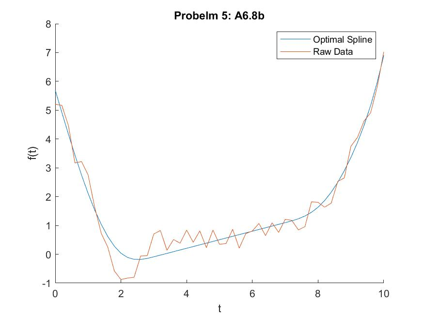

# MATLAB CODE AND RESULTS
This portion of the homework details the matlab cvx code used to optimize the problem presented in A6.8. This will be broken into a code section and a results section.

## Code
The following MATLAB code was used to optmize the spline problem:
``` MATLAB
%%
 %  File: Homework_2.m
 % 
 %  Author: Thomas Kost
 %  
 %  Date: 7 January 2022
 %  
 %  @brief homework 2 matlab problem concerning cubic splines
 %
 clear all, clc, close all;
 
 % Import data
 [t, y] = spline_data;
 % Generate splines
 %% 5b: splines
 M=10;
 alphas = [0:1:10];
 % Create A,b,G,h
 A = zeros(length(t),M+3);
 b = y;
 G = zeros(length(t),M+3);
 h = zeros(length(t),1);
 % Construct A
 for i =1:length(t)
     u = t(i);
     [g, gp, gpp] = bsplines(u);
     A(i,:) = g;
 end
 % Construct G
 for i = 1:length(alphas)
    [g, gp, gpp] = bsplines(alphas(i));
    G(i,:) = gpp;
 end

 % Optimize
 cvx_begin
     variable x(M+3)
     minimize(norm(A*x-b,2))
     subject to 
         G*x >=h
 cvx_end


 %% Plot Result
 spline_plot = figure();
 hold on
 plot(t, A*x)
 plot(t,y)
 title("Probelm 5: A6.8b")
 xlabel("t");
 ylabel("f(t)");
 legend(["Optimal Spline", "Raw Data"])
 hold off
 saveas(spline_plot, "optimal_splines.jpg")

 ```

## Results
 The following plot was generated showing the optimal spline given the provided data.

 