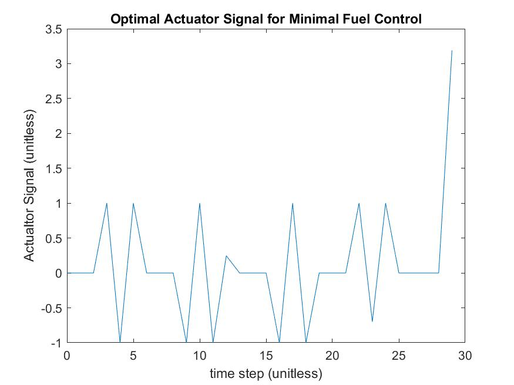

# MATLAB Portion

This section of the homework details the code and results for the last problem. The relevant code and results are shown below.

# Results
The following plot shows the optimal input for the given fuel curve and desired end state.



As we can see the optimal input remains largely on the set $[-1,1]$. This makes sense as the fuel curve has a higher cost for larger inputs, as a result this passes a quick sanity check. 

# Code

The following code block provides the script used to generate the optimal input.

```MATLAB

%%
 %  File: Homework_3.m
 % 
 %  Author: Thomas Kost
 %  
 %  Date: 25 January 2022
 %  
 %  @brief homework 3 matlab problem concerning optimal fuel control
 %
 clear all, clc, close all;

 % Problem Data
 A = [-1, 0.4, 0.8;
       1,   0,   0;
       0,   1,   0];
 b = [1; 0; 0.3];
 x_des = [7; 2; -6];
 N = 30;
 x_0 = [0;0;0];
 prop = zeros(3,N);
 for i = 1:N
     prop(:,i) = (A^(i-1))*b;
 end
     prop = fliplr(prop);
 % Perform optimization
cvx_begin
    variable u(N)
    minimize(sum(max(abs(u),2*abs(u)-1)))
    subject to
        prop*u == x_des
cvx_end
input = figure()
plot([0:N-1],u);
xlabel("time step (unitless)");
ylabel("Actualtor Signal (unitless)");
title("Optimal Actuator Signal for Minimal Fuel Control");
saveas(input, "optimal_input.jpg");
```