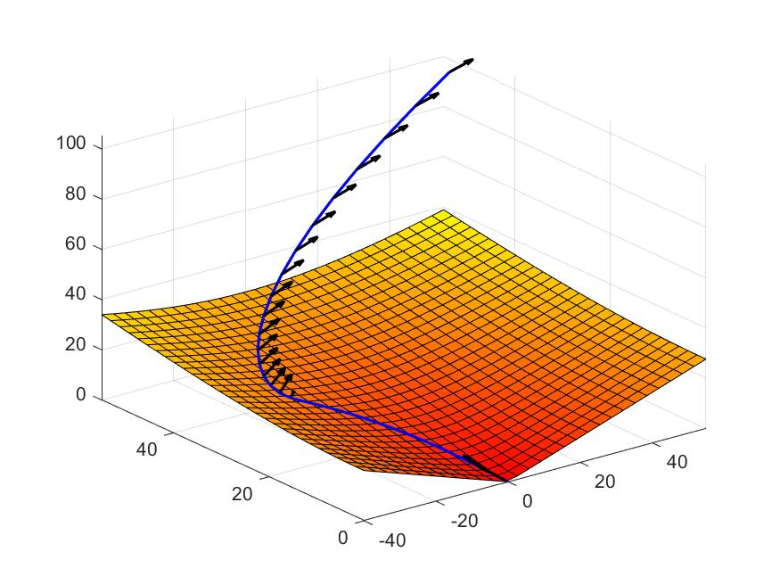
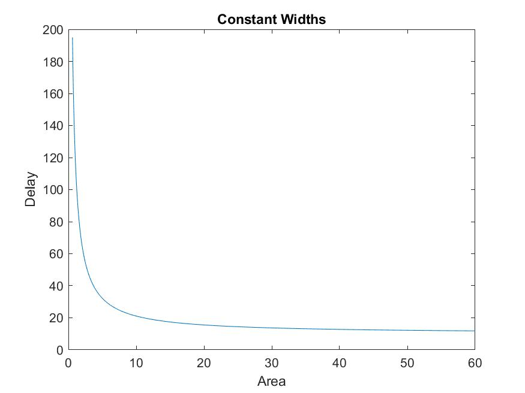
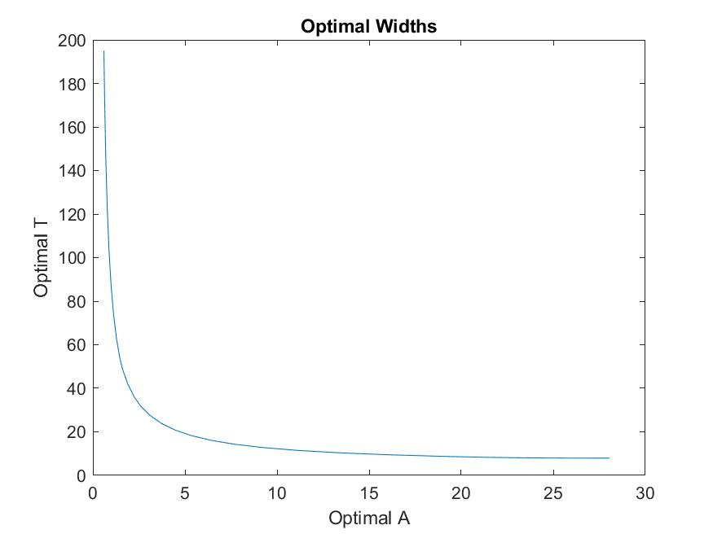
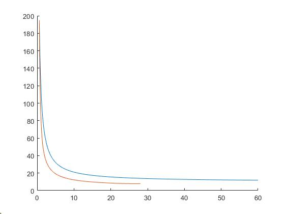

# Matlab Section
This section will discuss and show the relevant code and results for problem 2 and 5 of the homework. All relevant sections will be labeled. 

# 2C
We will first present the results for 2a. The relevant code is shown in the appendix of this document. We should note that the code is in a single file and each section is labeled. We calculated the minimum fuel consumption trajectory and resulted in the following plot. 



The resulting output from the matlab script was as follows :
```
-------- Optimal Fuel Solution-------
Optimal value (cvx_optval): +192.991
```
We can see from this that the optimal total fuel consumption was 192.991.

For part 2b we calculated the minimum time of descent. This was achieved through solving feasability problems and reducing the number of time esteps until failure.
In  solving this problem we created the following plot:


The resulting outpuyt from the matlab script was as follows:

```

-------- Optimal time Solution-------
--------------- solved --------------
Minimum Steps:  25
```

This tells us that the minimum number of discrete time steps needed for the given constraints to be met was 25 time steps of duration h.

# 5a 
In this problem we plotted Area against delay using the provided equations for 1000 valid choices of width. These choices of with were that all width was constant. This resulted in the following graph:



# 5b
In this problem we solve $A +\mu T$ for 40 different values of $\mu$ logarithmically spaced bwteeen 0.001 and 1000. In solving the relevant geometric program for these values we obtain the following plot:


 

As we can see the plots are incredibly similar in shape. However, the optimal width plot exists only on the sublevel set of the constant width plot (it is lower for all values). This seems to indicate that the constant width plot is some sublevel set on the constarined surface. We can see that the optimal widths have better tradeoffs between A and T in the following figure (with the optimal plotted in orange and the constant width values plotted in blue). this relationship is to be expected as feasable values will always perform equal to or worse than the optimal. But the constant value is a decent approximation.

