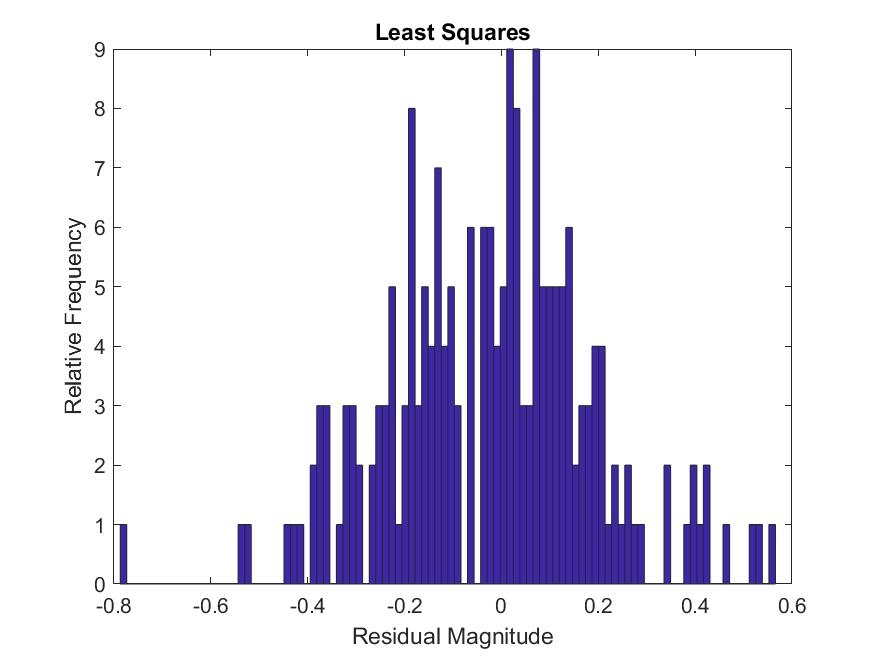
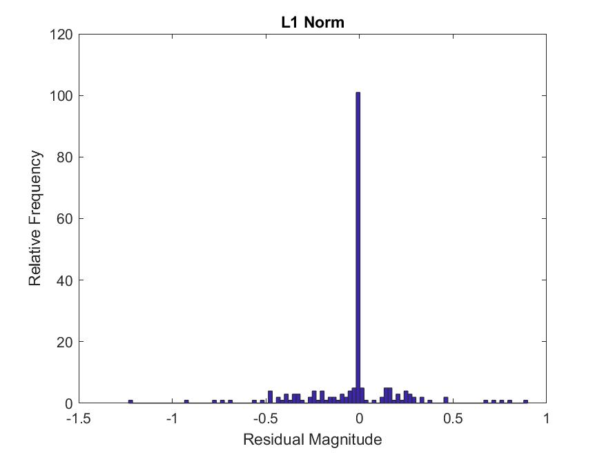
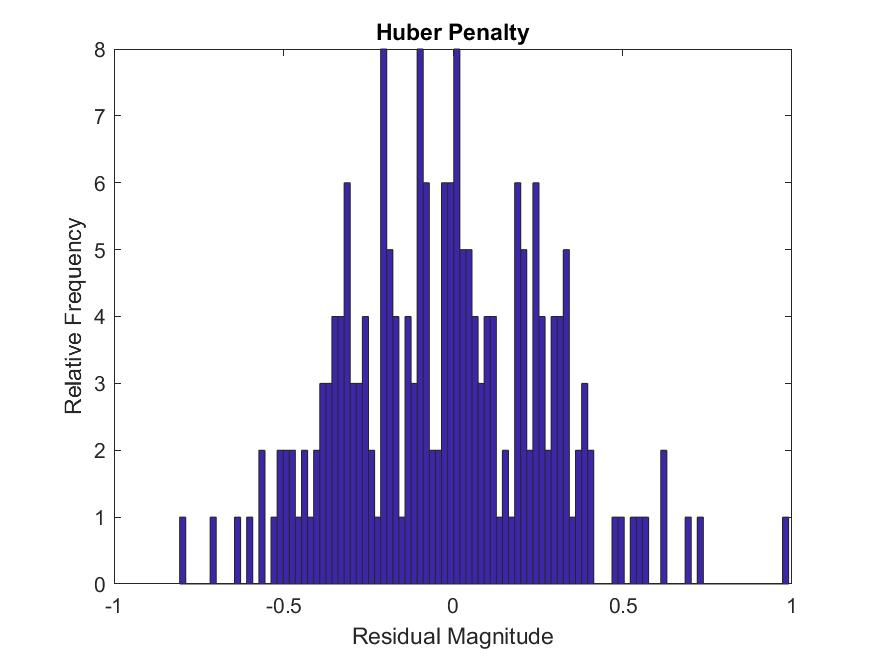

# MATLAB Section

This section will be broken up by problem. The results will be shown and discussed. The MATLAB code used to solve each relevant question will appear in the appendix. Each section of the code is labeled with its corresponding problem.
# 5D: SDP of a binary least squares problem

We calcualed all relevant values and computed their accuracy when compared to the original array. The code produced the following output: 

```
Determining Boolean Least Squares
----------------------------
Results for S =0.5
----------------------------
x_a Accuracy: 1
x_b Accuracy: 1
x_c Accuracy: 1
x_d Accuracy: 1
 
Results for S =1
----------------------------
x_a Accuracy: 1
x_b Accuracy: 1
x_c Accuracy: 1
x_d Accuracy: 1
 
Results for S =2
----------------------------
x_a Accuracy: 1
x_b Accuracy: 1
x_c Accuracy: 1
x_d Accuracy: 1
 
Results for S =3
----------------------------
x_a Accuracy: 0.825
x_b Accuracy: 0.925
x_c Accuracy: 0.95
x_d Accuracy: 0.975
 ```

For completeness I am including a table of each of the restuls aswell. 

For $S=0.5$:
```

    xhat    x_a    x_b    x_c    x_d
    ____    ___    ___    ___    ___

     -1     -1     -1     -1     -1 
     -1     -1     -1     -1     -1 
      1      1      1      1      1 
      1      1      1      1      1 
      1      1      1      1      1 
      1      1      1      1      1 
     -1     -1     -1     -1     -1 
      1      1      1      1      1 
     -1     -1     -1     -1     -1 
     -1     -1     -1     -1     -1 
     -1     -1     -1     -1     -1 
     -1     -1     -1     -1     -1 
      1      1      1      1      1 
      1      1      1      1      1 
     -1     -1     -1     -1     -1 
      1      1      1      1      1 
      1      1      1      1      1 
     -1     -1     -1     -1     -1 
      1      1      1      1      1 
     -1     -1     -1     -1     -1 
     -1     -1     -1     -1     -1 
     -1     -1     -1     -1     -1 
      1      1      1      1      1 
      1      1      1      1      1 
     -1     -1     -1     -1     -1 
     -1     -1     -1     -1     -1 
     -1     -1     -1     -1     -1 
     -1     -1     -1     -1     -1 
      1      1      1      1      1 
      1      1      1      1      1 
      1      1      1      1      1 
      1      1      1      1      1 
      1      1      1      1      1 
      1      1      1      1      1 
     -1     -1     -1     -1     -1 
     -1     -1     -1     -1     -1 
      1      1      1      1      1 
      1      1      1      1      1 
      1      1      1      1      1 
      1      1      1      1      1 

```

For $S=1$:
```
      xhat    x_a    x_b    x_c    x_d
    ____    ___    ___    ___    ___

     -1     -1     -1     -1     -1 
      1      1      1      1      1 
      1      1      1      1      1 
     -1     -1     -1     -1     -1 
     -1     -1     -1     -1     -1 
     -1     -1     -1     -1     -1 
      1      1      1      1      1 
     -1     -1     -1     -1     -1 
      1      1      1      1      1 
      1      1      1      1      1 
      1      1      1      1      1 
     -1     -1     -1     -1     -1 
     -1     -1     -1     -1     -1 
      1      1      1      1      1 
      1      1      1      1      1 
      1      1      1      1      1 
     -1     -1     -1     -1     -1 
      1      1      1      1      1 
      1      1      1      1      1 
     -1     -1     -1     -1     -1 
      1      1      1      1      1 
     -1     -1     -1     -1     -1 
      1      1      1      1      1 
      1      1      1      1      1 
     -1     -1     -1     -1     -1 
     -1     -1     -1     -1     -1 
      1      1      1      1      1 
     -1     -1     -1     -1     -1 
      1      1      1      1      1 
     -1     -1     -1     -1     -1 
      1      1      1      1      1 
     -1     -1     -1     -1     -1 
     -1     -1     -1     -1     -1 
      1      1      1      1      1 
     -1     -1     -1     -1     -1 
      1      1      1      1      1 
     -1     -1     -1     -1     -1 
     -1     -1     -1     -1     -1 
      1      1      1      1      1 
      1      1      1      1      1 
```
For $S=2$ :

```
 xhat    x_a    x_b    x_c    x_d
    ____    ___    ___    ___    ___

     -1     -1     -1     -1     -1 
      1      1      1      1      1 
      1      1      1      1      1 
      1      1      1      1      1 
     -1     -1     -1     -1     -1 
      1      1      1      1      1 
      1      1      1      1      1 
      1      1      1      1      1 
      1      1      1      1      1 
     -1     -1     -1     -1     -1 
     -1     -1     -1     -1     -1 
     -1     -1     -1     -1     -1 
      1      1      1      1      1 
     -1     -1     -1     -1     -1 
      1      1      1      1      1 
      1      1      1      1      1 
     -1     -1     -1     -1     -1 
      1      1      1      1      1 
     -1     -1     -1     -1     -1 
     -1     -1     -1     -1     -1 
     -1     -1     -1     -1     -1 
     -1     -1     -1     -1     -1 
      1      1      1      1      1 
     -1     -1     -1     -1     -1 
     -1     -1     -1     -1     -1 
     -1     -1     -1     -1     -1 
      1      1      1      1      1 
     -1     -1     -1     -1     -1 
     -1     -1     -1     -1     -1 
      1      1      1      1      1 
      1      1      1      1      1 
      1      1      1      1      1 
     -1     -1     -1     -1     -1 
     -1     -1     -1     -1     -1 
     -1     -1     -1     -1     -1 
     -1     -1     -1     -1     -1 
      1      1      1      1      1 
      1      1      1      1      1 
      1      1      1      1      1 
      1      1      1      1      1 
```

For $S=3$:
```
xhat    x_a    x_b    x_c    x_d
    ____    ___    ___    ___    ___

      1      1     -1      1      1 
      1      1      1      1      1 
      1      1      1      1      1 
      1      1      1      1      1 
     -1     -1     -1     -1     -1 
      1      1      1      1      1 
     -1     -1     -1     -1     -1 
     -1     -1     -1     -1     -1 
     -1     -1     -1     -1     -1 
     -1     -1     -1     -1     -1 
     -1      1     -1     -1     -1 
      1      1      1      1      1 
     -1     -1     -1     -1     -1 
      1     -1      1      1      1 
      1      1      1      1      1 
     -1     -1     -1     -1     -1 
     -1     -1     -1     -1     -1 
     -1     -1     -1     -1     -1 
      1      1      1      1      1 
      1      1      1      1      1 
     -1     -1     -1     -1     -1 
     -1     -1     -1     -1     -1 
      1      1      1      1      1 
     -1      1     -1     -1     -1 
     -1     -1     -1     -1     -1 
     -1      1     -1     -1     -1 
      1      1      1      1      1 
      1     -1      1      1      1 
      1     -1     -1     -1      1 
      1      1      1      1      1 
     -1     -1     -1     -1     -1 
     -1      1     -1     -1     -1 
      1      1      1      1      1 
     -1     -1     -1     -1     -1 
     -1     -1     -1     -1     -1 
      1      1      1      1      1 
     -1     -1     -1     -1     -1 
     -1     -1      1      1      1 
      1      1      1      1      1 
      1      1      1      1      1 
```
# Problem 6
Since each part of problem 6 asked us to plot the reuslts of a minimization with a specific penalty function, we will show the resulting plots. 








# Appendix

I have placed all relevant matlab code here:

```MATLAB
%%
 %  File: hw7.m
 % 
 %  Author: Thomas Kost
 %  
 %  Date: 10 February 2022
 %  
 %  @brief homework 7 matlab problems concerning boolean least squares
 %
 clc,clear all,close all;
 
 %% 5d:SDP for binary least squares
 disp ('Determining Boolean Least Squares');
disp ('----------------------------');
 warning('off');
 s_s = [0.5 1 2 3];
 randn('state',0)
 m = 50;
 n = 40;
 for i =1:length(s_s)
     s = s_s(i);
    A = randn(m,n);
    xhat = sign(randn(n,1));
    b = A*xhat + s*randn(m,1);
    x_a = sign(A\b);
    cvx_begin sdp quiet
        variables z(n) Z(n,n)
        minimize(trace(A'*A*Z)-2*b'*A*z+b'*b)
        subject to
            diag(Z)==ones(n,1);
            [Z,z;z',1] >= 0;
            Z >= 0;
    cvx_end
    x_b = sign(z);
    [V,D] = eigs([Z,z;z',1]);
    x_c = sign(-V(1:n,1));
    samps = sign(mvnrnd(z,Z-z*z',100));
    x_d = zeros(n,1);
    min_obj = inf;
    for j = 1:100
        obj_value = norm(A*samps(j,:)'-b)^2;
        if obj_value <= min_obj
            x_d = samps(j,:)';
            min_obj = obj_value;
        end
    end
    disp (['Results for S =', num2str(s)]);
    disp ('----------------------------');
    accuracy_a = mean(xhat==x_a);
    accuracy_b = mean(xhat==x_b);
    accuracy_c = mean(xhat==x_c);
    accuracy_d = mean(xhat==x_d);
    disp(['x_a Accuracy: ', num2str(accuracy_a)]);
    disp(['x_b Accuracy: ', num2str(accuracy_b)]);
    disp(['x_c Accuracy: ', num2str(accuracy_c)]);
    disp(['x_d Accuracy: ', num2str(accuracy_d)]);
    disp(' ');
    %T = table(xhat,x_a,x_b,x_c,x_d)
 end
 
 %% Penalty Functions
 disp(' ')
disp ('Determining Penalty Residuals');
disp ('----------------------------');
m = 200;
n = 100;
A = randn(m,n);
b = randn(m,1);
b = b/(1.01*max(abs(b)));
 % Part A:
x = A\b;
ls = figure();
hist(A*x-b,m/2);
title('Least Squares');
ylabel("Relative Frequency")
xlabel("Residual Magnitude")
saveas(ls, 'least_squares_penalty.jpg');

% Part B
cvx_begin quiet
variable x(n)
minimize(norm(A*x-b,1));
cvx_end
one_norm = figure();
hist(A*x-b,m/2);
title('L1 Norm');
ylabel("Relative Frequency")
xlabel("Residual Magnitude")
saveas(one_norm, 'one_norm_penalty.jpg');

% Part D
cvx_begin quiet
variable x(n)
minimize(sum(max(zeros(n,1),max(abs(x)-0.2,2*abs(x)-0.5))));
cvx_end
pwl = figure();
hist(A*x-b,m/2);
title('Piecewise Linear');
ylabel("Relative Frequency")
xlabel("Residual Magnitude")
saveas(pwl, 'piecewise_linear_penalty.jpg');

% Part E
cvx_begin quiet
variable x(n)
minimize(sum(huber(x,0.2)));
cvx_end
huber = figure();
hist(A*x-b,m/2);
title('Huber Penalty');
ylabel("Relative Frequency")
xlabel("Residual Magnitude")
saveas(huber, 'huber_penalty.jpg');
```
