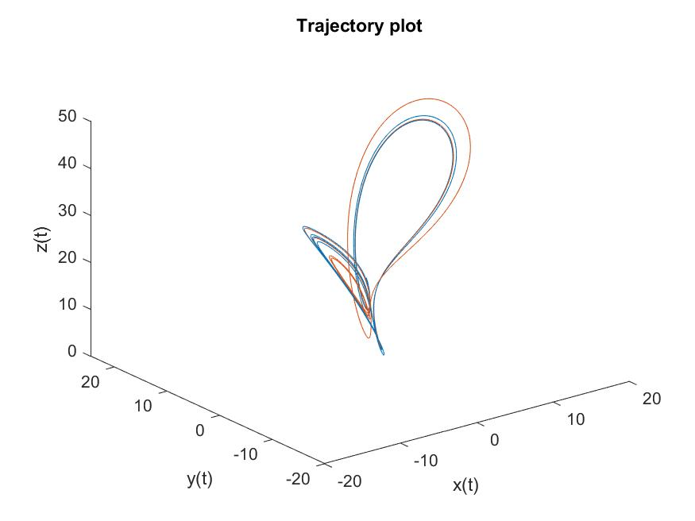
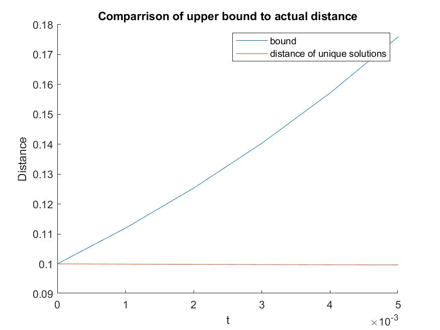

# Numerical Simulation to verify Continuity of solutions
In this section we will be numerically simulating the lorenz attractor for different initial conditions. We will compare the 1-norm distance between these solutions to the upper bound given to us by the continuity of solutions theorem. We are able to apply the continuity of solutions theorem as we have verified the function is lipchitz continuous for a ball of radius $\epsilon$ which contains our solution for the time interval $t \in [0,5]$. The MATLAB code relevant to this analysis will be found in the appendix. Additionally, the method for which our lipshitz constant and $\epsilon$ were chosen are described in the handwritten section.
# Setup
For the solutions we generated we chose an initial condition of $$x_{0} =   \begin{bmatrix}0 \\ 1 \\ 20\\\end{bmatrix}$$ as these are canonical starting values for the lorenz attractor. We chose an inital condition to be within $\delta = 0.1$ 1-normed distance of our original condition, this produced a second intial condition of $$x_{1} =   \begin{bmatrix}-0.1 \\ 1 \\ 20\\\end{bmatrix}$$
The solutions were then computed for the for $t \in [0,5]$. 

# Results 
Upon numerically simulating the solutions we created the below trajectories in Figure 1.



We can see that as time grows they begin to divirge from one another. Upon taking the distance between each solution at every time point and comparing it to our upper bound on differences in solutions (determined by our difference in initial conditions and lipschitz constant $L$) we produced Figure 2.



It should be noted that Figure 2 is zoomed in quite a bit, but this is to emphasize the nature of the upper bound. We can see that the upper bound grows immenslely faster than the true difference in solutions. This is indicative of this being an extremely relaxed upper bound. At no point in our 5 second interval does the true difference begin to approach the upper bound given by the contiunity of solutions theorem. As a result, we can note that for the lorenz attractor this is an extremely conservative bound.

We can speculate that this is due to the fact that the lorenz attractor produces results that do not divirge greatly. That is, that the attractor itself will bring soluitions arbitrairly close to one another over and over which does not cause the distance between solutions to grow in an unbounded manner.

# Appendix
The following code block contains the script used to produce the plots and results discussed in this document.

```MATLAB
%%
 %  File: Homework_1.m
 % 
 %  Author: Thomas Kost
 %  
 %  Date: 20 January 2022
 %  
 %  @brief homework 1 matlab simulation of continuity of solutions bound
 %
 clear all, clc, close all;
 %% Define system
 sigma = 10;
 rho = 28;
 beta = 8/3;
 Beta = [sigma; rho; beta];
 %% Define initial conditions
 delta = 0.1;
 x_0 = [0, 1, 20];
 x_1 = x_0 - [delta,0,0];
 
 dt = 0.001;
 tspan = [0:dt:5];
 [t,x] = ode45(@(t,x)lorenz(t,x,Beta), tspan, x_0);
 [t1,x1] = ode45(@(t1,x1)lorenz(t1,x1,Beta), tspan, x_1);
 trajectory_plot = figure();
 plot3(x(:,1),x(:,2),x(:,3),x1(:,1),x1(:,2),x1(:,3))
 xlabel('x(t)')
 ylabel('y(t)')
 zlabel('z(t)')
 title("Trajectory plot");
 saveas(trajectory_plot, "trajectory_plot_hw1.jpg");
 max_disp = max(abs(x-x_0)*ones(3,1)); %one norm
 epsillon = ceil(max_disp);
 L = max([2*sigma, abs(rho-x_0(3))+abs(x_0(1))+1+2*epsillon, abs(x(2)) +abs(x(1))+beta+2*epsillon]);
 
 % Compute distances
 bound = norm(x_0-x_1,1)*exp(L*t);
 dist = abs(x-x1)*ones(3,1);
 bound_plot = figure();
 hold on;
 plot(t,bound);
 plot(t,dist);
 xlim([0 0.005]);
 legend(["bound", "distance of unique solutions"]);
 xlabel("t");
 ylabel("Distance");
 title("Comparrison of upper bound to actual distance");
 hold off;
 saveas(bound_plot, "bound_plot_hw1.jpg");
 ```
 The following function defines our lorenz attractor:
 
 ```MATLAB
 %%
 %  File: lorenz.m
 % 
 %  Author: Thomas Kost
 %  
 %  Date: 20 January 2022
 %  
 %  @brieffunction for lorenz attractor sim
 %
 function dx = lorenz(t,x,Beta)
 dx =[...
    Beta(1)*(x(2) - x(1));...
    x(1)*(Beta(2) - x(3)) - x(2);...
    x(1)*x(2) - Beta(3)*x(3);...
    ];
```