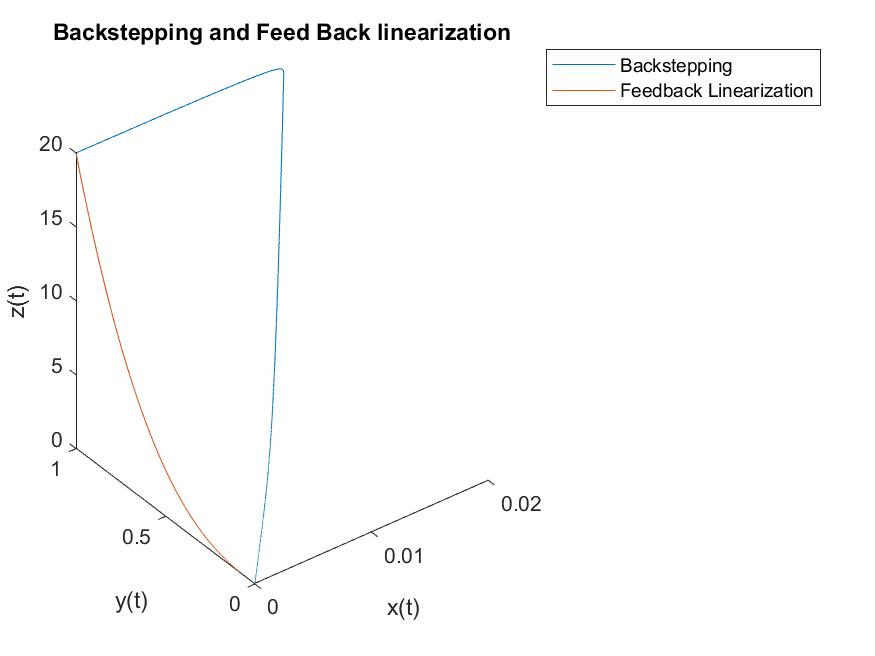
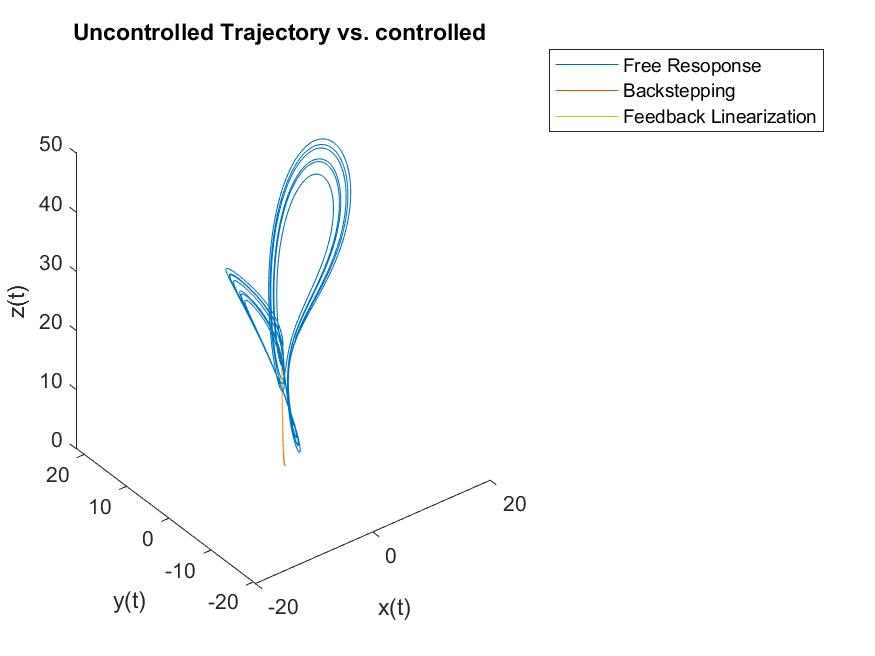
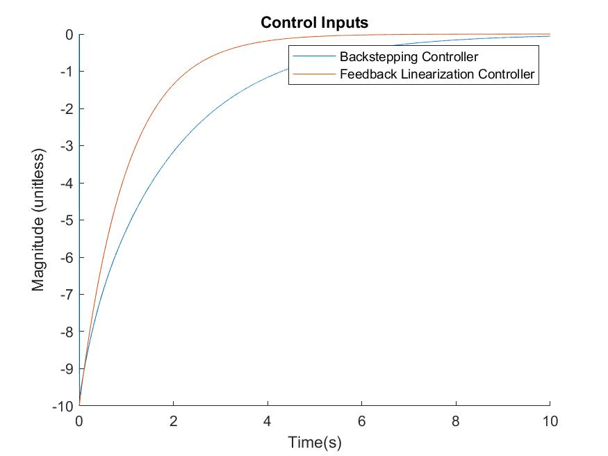

# Numerical Simulation of Controlled Systems

In this section of the homework we will numerically simulate the results of the controllers we desigend through feedback linearization and through backstepping. We will see that the controllers stabalize our system asymtotically. 

# Setup 

As described in the handwritten portion we have derived the following two controllers
$$U_{feedback_linear} = -\sigma(y-x)-10x$$
$$U_{backstepping} = (-\sigma +\frac{\sigma}{2\rho}-\frac{0.5}{2\rho})y -\frac{xz}{2\rho}$$
We were able to show our normal dynamics to be ISS for the feed back linearization and found a control lyapanov function for our backstepping procedure that show our system will be asymtotically stable. The results are shown and discussed below.

# Results
We ran a numerical siumulation with the initial condition $x = \begin{bmatrix}0 \\ 1 \\ 20\\\end{bmatrix}$ as previously, however we added the input to each simulation. This produced the following image:


As we can see both systems quicky converge to the equilibrium point $x^{\star} = \begin{bmatrix} 0\\ 0\\ 0\\\end{bmatrix}$. This validates our controller analysis. Furhtermore, for fun, I simulated the uncontrolled dynamics and plotted it with the controlled dynamics for a comparrison. The following plot illustrates the difference of controlling our system:



While the image may be a little difficult to see, we can see that the free response still has wild oscillations, while the controlled responses nicely divirge from the natural dynamics and decay to zero. 

We can see too that the system approaches stability through looking at our control input. We can see the controllers require less and less effort to drive the system. Additionally, in comparing them we can see that our feedback linearization controller requires less control effort than our backstepping controller in this simuilation. 



# Comparrison
We can see that both controllers cause our state to decay to 0. However, we can see that our feedback linearization controller is much more effective. It requires less control effort and has a faster decay rate. Our backstepping controller on the other hand initially drives our state away from the equilibrium. This maks sense to some degree as our backstepping controller contains more nonlinearities. It is also possible there exist initial contions in which the results would be approximately switched. However, the end result is that both methods produces stable controllers, whose control inputs follow a similar trajectory. 

# Appendix
The following code block contains the script used to produce the plots and results discussed in this document.

```MATLAB
%%
 %  File: hw4.m
 % 
 %  Author: Thomas Kost
 %  
 %  Date: 10 February 2022
 %  
 %  @brief homework 4 feedback linearization and backstepping controller
 %  comparrison for Lorenz attractor
 %
 clc,clear all,close all;
 %% Define system
 sigma = 10;
 rho = 28;
 beta = 8/3;
 Beta = [sigma; rho; beta];
 x_0 = [0, 1, 20];
 
 %% Simulate System
 dt = 0.001;
 tspan = [0:dt:10];
 [t,x] = ode45(@(t,x)lorenz_backstepped(t,x,Beta), tspan, x_0);
 [t1,x1] = ode45(@(t1,x1)lorenz_feedback_linearize(t1,x1,Beta), tspan, x_0);
 trajectory_plot = figure();
 plot3(x(:,1),x(:,2),x(:,3),x1(:,1),x1(:,2),x1(:,3))
 legend('Backstepping', 'Feedback Linearization')
 xlabel('x(t)')
 ylabel('y(t)')
 zlabel('z(t)')
 title('Backstepping and Feed Back linearization')
 saveas(trajectory_plot, "trajectory_plot_hw4.jpg");
    uncontrolled = figure();
 [t,x2] = ode45(@(t,x)lorenz(t,x,Beta), tspan, x_0);
 plot3(x2(:,1),x2(:,2),x2(:,3),x(:,1),x(:,2),x(:,3),x1(:,1),x1(:,2),x1(:,3))
 xlabel('x(t)')
 ylabel('y(t)')
 zlabel('z(t)')
 title("Uncontrolled Trajectory vs. controlled ");
  legend('Free Resoponse','Backstepping', 'Feedback Linearization')

  saveas(trajectory_plot, "trajectory_plot_hw4.jpg");

%%%%%%%%%%%%%%%%%%%%%%%%%%%%%%%%%%%%%%%%%%%%%%%%%%%%%%%%%%%%%%%%%%%%%%%%%%%%%%%%%%%%%%%%%%
%%
 %  File: lorenz_backstepped.m
 % 
 %  Author: Thomas Kost
 %  
 %  Date: 20 January 2022
 %  
 %  @brieffunction for lorenz attractor sim
 %
 function dx = lorenz_backstepped(t,x,Beta)
 lambda = 2*Beta(2)*Beta(1)+1;
 u = (-Beta(1) + lambda/(2*Beta(2))- 1/(2*Beta(2)))*x(2) +(Beta(1) +0.5 -lambda)*x(1)-...
     x(1)*x(3)/(2*Beta(2));
 
 dx =[...
    Beta(1)*(x(2) - x(1))+u;...
    x(1)*(Beta(2) - x(3)) - x(2);...
    x(1)*x(2) - Beta(3)*x(3);...
    ];
%%%%%%%%%%%%%%%%%%%%%%%%%%%%%%%%%%%%%%%%%%%%%%%%%%%%%%%%%%%%%%%%%%%%%%%%%%%%%%%%%%%%%%%%%%%
%%
 %  File: lorenz_feedback_linearize.m
 % 
 %  Author: Thomas Kost
 %  
 %  Date: 20 January 2022
 %  
 %  @brieffunction for lorenz attractor sim
 %
 function dx = lorenz_feedback_linearize(t,x,Beta)
 alpha1 = 10;
 u = -Beta(1)*(x(2)-x(1))-alpha1*x(1);
 
 dx =[...
    Beta(1)*(x(2) - x(1))+u;...
    x(1)*(Beta(2) - x(3)) - x(2);...
    x(1)*x(2) - Beta(3)*x(3);...
    ];
```